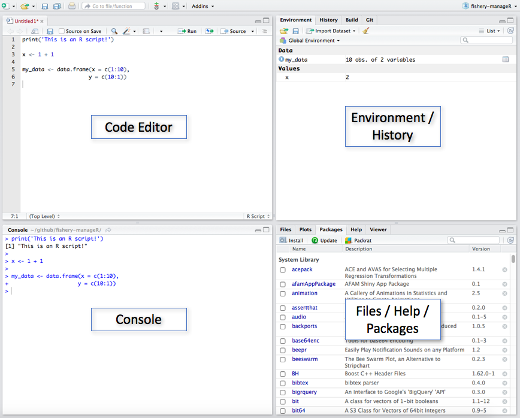

```{r setup, include=FALSE}
knitr::opts_chunk$set(echo = FALSE)
```

## Welcome

-   This workshop is a part of [UConn Sports Analytics Symposium (UCSAS) 2024](https://statds.org/events/ucsas2024/index.html).
-   This workshop aims to give a quick tour of R.
-   All source codes of related documents of this workshop are in the GitHub repository: <https://github.com/fushengyy/UCSAS2024_intro_to_R>.

## About Me

-   Fifth-year Ph.D. Student in Statistcs at UConn.
-   **Research Interests:**
    -   Time series analysis.
-   **Future goals:**
    -   Contribute to the broader field of environmental statistics.

## Prerequisites

-   A laptop with R/RStudio installed
    -   R can be downloaded for windows users [here](https://cran.r-project.org/bin/windows/base/) and for Mac users [here](https://cran.r-project.org/bin/macosx/);
    -   RStudio can be downloaded for all users [here](https://www.rstudio.com/products/rstudio/download/).
-   Little to no experience with R.

## Outline

-   R Basics
-   R Data Structure
-   Read and Write Data
-   Data Management
-   Brief Overview of "dplyr" Package

## What is R?

-   R is a free and open-source language and environment for statistical computing and graphics.
-   First created by statisticians Ross Ihaka and Robert Gentleman in August 1993.
-   Now supported by the R Core Team (formed in 1997) and the R Foundation for Statistical Computing (formed in 2003).

## What is RStudio?

-   RStudio is an integrated development environment (IDE) for R.
-   It is available in two formats:
    -   **RStudio Desktop**: a regular desktop application;
    -   RStudio Server: runs on a remote server and allows accessing RStudio using a web browser.

## RStudio Interface

<center>

{#id .class width="65%" height="65%"}

## R as a calculator

-   `+` Addition

-   `-` Subtration

-   `*` Multiplication

-   `/` Division

-   `^` or `**` Exponentiation

-   Some built-in functions:

    -   `sqrt()` Square root
    -   `log()` Natural log

More [here](https://www.javatpoint.com/r-built-in-functions).

## Getting Help

The `help()` function and `?` operator in R provide access to the documentation pages for R functions, data sets, and other objects.

Example:

To get help with the `mean` function, we can use either

```{r echo = TRUE, eval = FALSE}
help(mean)
```

or

```{r echo = TRUE, eval = FALSE}
?mean
```

## Assignment Operators

Assign a value to a name using `<-`, `->`, or `=`.

Example:

```{r, echo = TRUE, eval = FALSE}
x <- 5
"Hello World!" -> y
z = 2024
```

## Data Types

In R, there are 6 basic data types:

-   Logical: boolean data type, can have two values: `TRUE` and `FALSE`;
-   Numeric: all real numbers with or without decimal values;
-   Integer: real values without decimal points;
-   Complex: purely imaginary values;
-   Character: character or string values. 'A' is a single character, "Apple" is a string. You can use single quotes `''` or double quotes `""`;
-   Raw: specifies values as raw bytes. This will NOT be discussed in this workshop.

## Data Structures

R has many data structure. The most essential ones are

-   Vector
-   List
-   Dataframe
-   Matrix
-   Array

## Data Structures (cont.)

-   Vector: a collection of elements. Note the elements of a vector must be of the identical data type (Homogeneous). Vectors are one-dimensional data structures.
-   List
-   Dataframe
-   Matrix
-   Array

## Data Structures (cont.)

-   Vector
-   List: a generic object consisting of an ordered collection of objects. A list can contain vectors or elements of unequal dimensions or different data types (Heterogeneous).
-   Dataframe
-   Matrix
-   Array

## Data Structures (cont.)

-   Vector
-   List
-   Dataframe: generic data objects of R which are used to store the tabular data. Dataframes are two-dimensional, heterogeneous data structures contain lists of vectors of equal lengths. Note a dataframe must have column names. Each column must have the identical number of items. Each item in a single column must be of the same data type. Different columns may have different data types.
-   Matrix
-   Array

## Data Structures (cont.)

-   Vector
-   List
-   Dataframe
-   Matrix: a rectangular arrangement of numbers in rows and columns. Matrices are two-dimensional, homogeneous data structures.
-   Array

## Data Structures (cont.)

-   Vector
-   List
-   Dataframe
-   Matrix
-   Array: the R data objects which store the data in more than two dimensions. Arrays are n-dimensional data structures.

## Data Structures (cont.)

|     | Homogeneous | Heterogeneous |
|:---:|:-----------:|:-------------:|
| 1d  |   Vector    |     List      |
| 2d  |    Matrx    |   Dataframe   |
| nd  |    Array    |               |

## Quiz 1

Consider $x = (7,7,9,6,55,2)$

-   What is the length of this vector?
-   What are unique values of $x$?
-   Sort the values of $x$.
-   Frequency distribution of $x$.

## Quiz 2

How would you describe the following three objects? What makes them different to 1:5?

```{r echo = TRUE, eval = FALSE}
x1 <- array(1:5, c(1, 1, 5))
x2 <- array(1:5, c(1, 5, 1))
x3 <- array(1:5, c(5, 1, 1))
```

## Quiz 3

Let $A = \begin{bmatrix} 1 & 2 \\ 3 & 4 \end{bmatrix}$ and $B = \begin{bmatrix} 5 & 7 \\ 6 & 8 \end{bmatrix}$.

Find

-   dimensions of $A$ and $B$;
-   determinants of $A$ and $B$;
-   $A+B$;
-   $AB$;
-   $A^{-1}$ and $B^{-1}$.

## Function

-   An R function is created by using the keyword "function".
-   Basic syntax:

```{r echo = TRUE, eval = FALSE}
function_name <- function(arg_1, arg_2, ...) {
    Function body
}
```

## Function (cont.)

-   Components:
    -   **Function Name**: the actual name of the function. It is stored in R environment as an object with this name.
    -   **Arguments**: a placeholder. When a function is invoked, you pass a value to the argument. Arguments are optional; that is, a function may contain no arguments. Also arguments can have default values.
    -   **Function Body**: contains a collection of statements that defines what the function does.
    -   **Return Value**: the last expression in the function body to be evaluated.

## Quiz 4

Write a function that takes $x$ and $y$ as inputs and returns the value $y^x$.

## Loop

We use loop to deal with repeated tasks.

-   **for** loop: the most commonly used loop structure when you want to repeat a task a defined number of times.
-   **while** loop: used when you want to keep looping until a specific logical condition is satisfied (contrast this with the for loop which will always iterate through an entire sequence).

## Condition

-   **if**: The *if* statement takes a condition; if the condition evaluates to `TRUE`, the R code associated with the *if* statement is executed.
-   **if ... else ...**: The code associated with the *else* statement gets executed whenever the condition of the *if* condition is `FALSE`.
-   **if ... else if ... else**: The *else if* condition is checked if the first condition is not satisfied. If the second condition is then met, then the code inside it is executed.

## Quiz 5

Using the conditional statement, check whether -9 is divisible by 2 or by 3.

## Read and Write Data from/to Local Directory

-   Read data syntax:

```{r echo = TRUE, eval = FALSE}
read.table(file = "location_of_file", header = TRUE)
```

-   Write/Save data syntax:

```{r echo = TRUE, eval = FALSE}
write.table(dataName, file = "location_of_file")
```

-   Some useful functions:

```{r echo = TRUE, eval = FALSE}
read.csv(), read.csv2(), write.csv(), write.csv2(), etc.
```

## Install and Load R Packages

-   Install a package syntax:

```{r echo = TRUE, eval = FALSE}
install.packages("package_name")
```

-   Load a package syntax:

```{r echo = TRUE, eval = FALSE}
library("package_name")
```

-   Install and load "Lahman" package:

```{r echo = TRUE, eval = FALSE}
install.packages("Lahman")
library(Lahman)
```

```         
-   "Lahman" package contains historical season-level baseball data for Major League 
Baseball going back to 1871.
```

## Search and Read Datasets in a Package

-   Search datasets from a package syntax:

```{r echo = TRUE, eval = FALSE}
data(package = "package_name")
```

-   Read a particular dataset from a package syntax:

```{r echo = TRUE, eval = FALSE}
data("dataName", package = "package_name")
```

-   Search and Read Datasets in "Lahman"

```{r echo = TRUE, eval = FALSE}
data(package = "Lahman")
data("Batting", package = "Lahman")
```

## Data Manipulation using Base R

`str(Batting)`: : Check variables. (For more information about the dataset, check [here](https://rdrr.io/cran/Lahman/man/Batting.html).)

`names(Batting)`: Names of variables in the dataset.

`head(Batting)`: Display the first few rows of the dataset.

`Batting[, 1:4]`: Display the first 4 columns of the dataset.

`Batting[1:4,]`: Display the first 4 rows of the dataset.

## Data Manipulation using Base R (cont.)

`Batting$playerID`: Display values of the variable "playerID".

`Batting[, c("playerID")]`: Display values of the variable "playerID".

`Batting[1:10, c("playerID", "yearID")]`: Display the first 10 elements of the variables "playerID" and "yearID".

`Batting$CS_SO <- Batting$CS + Batting$SO`: Create a new variable "CS_SO" by adding up values of variables "CS" and "SO".

`Batting[, c("CS", "SO", "CS_SO")]`: Display only "CS", "SO", and "CS_SO" of the updated dataset.

More base R options check [here](https://github.com/rstudio/cheatsheets/blob/main/base-r.pdf).

## Quiz 6

Using dataset "Batting"

-   Display data from year 1900 only.
-   Find total number of players and teams played through out all games in the dataset.
-   Create a new dataframe "Batting1950" for year 1950 only.

## Data Manipulation using dplyr

**dplyr**: a R package which provides a set of tools for efficiently manipulating datasets.

-   Installation and loading:

```{r echo=TRUE, eval=FALSE}
install.packages("dplyr")
library(dplyr)
```

-   Load dataset "Salaries" from package "Lahman":

```{r echo = TRUE, eval = FALSE}
data("Salaries", package = "Lahman")
head(Salaries)
```

## Data Manipulation using dplyr (cont.)

-   Remove league info (variable "lgID") from "Salaries". i.e. select all variables but "lgID":

```{r echo = TRUE, eval = FALSE}
salaries <- Salaries %>% select(playerID, yearID, teamID, salary)
```

-   Join salary info and batting info together:

```{r echo = TRUE, eval = FALSE}
batting <- left_join(Batting, salaries, by = c("playerID", "yearID", "teamID"))
```

```         
-   `left_join(a, b, by = "x1")`: Join matching rows from b to a.
```

-   Rearrange orders of the dataset by multiple variables:

```{r echo = TRUE, eval = FALSE}
batting <- batting %>% arrange(playerID, yearID)
```

More dplyr options check [here](https://github.com/rstudio/cheatsheets/blob/main/data-transformation.pdf).

## Quiz 7

-   Using dataset "Batting" to find players who have a minimum of 25 base on balls before the year of 1900 and save to a new dataframe "player25".

-   Rearrange these players based on base on balls in a descending order and save to a new dataframe "player25_ordered".


## Useful References

-   [R Programming for Data Science](https://bookdown.org/rdpeng/rprogdatascience/) by Roger D. Peng;
-   [An Introduction to R](https://cran.r-project.org/doc/manuals/r-release/R-intro.pdf) by W. N. Venables, D. M. Smith and the R Core Team;
-   [R for Data Science](https://r4ds.had.co.nz/index.html) by Hadley Wickham and Garrett Grolemund

## Thank You!

Good luck with coding R.
